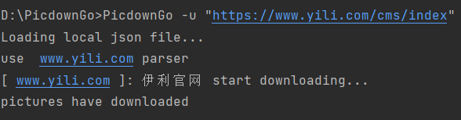
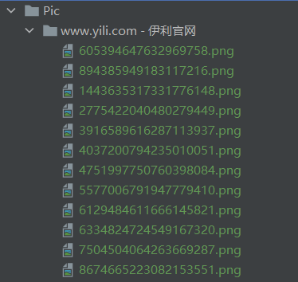

# PicdownGo

#### 项目利用命令行实现了特定网站下载静态图片
#### 


## 使用方法
不指定并行下载数量时，默认为20
```bash
PicdownGo -u URL
```
或者通过 -w + worknum 指令指定对应的工作数量
```bash
PicdownGo -u URL -w worknum
```
## 测试效果
下载完成后，图片存放在特定文件夹下，并使用随机数字命名。




## 支持网站
- [QQ网](https://qq.com/)
- [新浪网](https://www.sina.com.cn)
- [书栈网](https://www.bookstack.com.cn)
- [伊利网](https://www.yili.com)

## 项目原理
### 加载Json配置
json是一个文本文件，将对应的数据读取到后，赋值给全局变量。
```go
    if checkFileIsExits(jsonFileAddr) {
        file, _ = os.ReadFile(jsonFileAddr)
        fmt.Println("Loading local json file...")
    } else {
        err := errors.New("json file is not Existed")
        return err
    }
    if len(file) == 0 {
        fmt.Println("Json file is empty,Loading default parser...")
        file = DefaultJson
    }
    err = json.Unmarshal(file, &configuration)
```
### 解析域名
通过输入的URL与json文件中支持的网站列表对比，获取域名准备下载。
```go
    u, err := url.Parse(postUrl)
    if err != nil {
        return nil, fmt.Errorf("URL may be wrong,%w", err)
    }
    targetDomain = u.Host
    for index, website := range configuration.SupportWebsites {
        if strings.Contains(targetDomain, website.Website) {
            fmt.Println("use ", configuration.SupportWebsites[index].Website, "parser")
            return &configuration.SupportWebsites[index], nil
        }
    }
```
### 并行下载
通过 goroutine以及waitgroup和channel 并行下载同一网址的不同地址的图片
```go
    defer wg.Done()
    for picUrl := range linkChan {
        err := downloading(destDir, picUrl, targetWeb)
        if err != nil {
            log.Printf("%s", err)
        }
    }
```